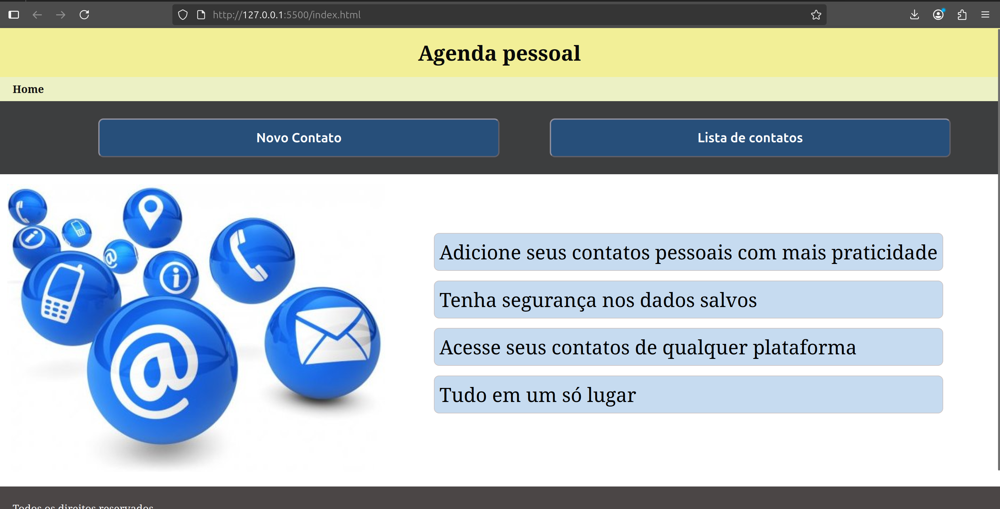
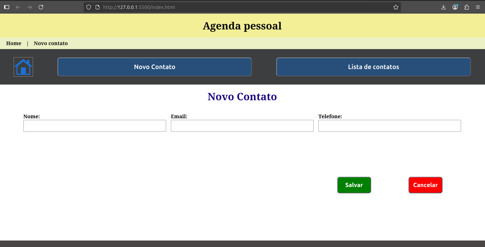
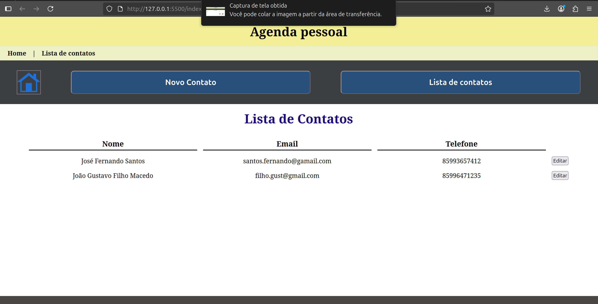
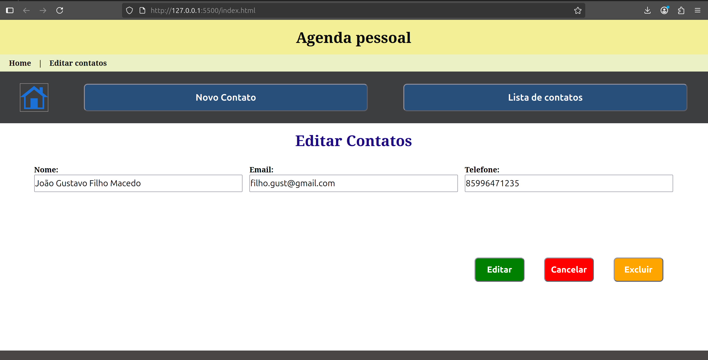

# 📒 Websistema para Armazenamento de Contatos Pessoais


Este projeto foi desenvolvido como desafio da disciplina de **Programação para Web**.  
O objetivo é a construção de uma **agenda digital** simples para cadastro e gerenciamento de contatos pessoais.

---

## 📖 Índice
1. [Sobre](#-sobre)
2. [Tecnologias](#-tecnologias)
3. [Instalação](#-instalação)
4. [Prints](#-prints)
5. [Uso](#-uso)
6. [Contribuição](#-contribuição)
7. [Licença](#-licença)

---

## 1. Sobre 📌
O sistema permite ao usuário **criar, editar, visualizar e excluir contatos pessoais**.  
Como o objetivo é didático, o projeto **não utiliza banco de dados**: os dados são armazenados no **localStorage** do navegador.

---

## 2. Tecnologias 💻
- **HTML**  
- **CSS**  
- **JavaScript**  
- **LocalStorage**

---

## 3. Instalação 🛠
1. Clone o repositório:
   ```bash
   git clone https://github.com/CaririTeam/Projeto-Final-Programa-Web.git
2. Abra o repositório clonado com o VScode;
3. Abra o arquivo index.html com a extensão Live Server do VScode;

## 4. Prints das telas do websistema 📸
 
 
 


## 5. Uso ▶️
Na tela inicial, o usuário pode visualizar a lista de contatos ou adicionar um novo.
Na lista, é possível editar um contato existente.
Na tela de edição, também é possível excluir o contato.

## 6. Contribuição 🤝
1. Faça um Fork
2. Crie uma branch (`git checkout -b minha-feature`)
3. Commit suas mudanças (`git commit -m 'Adicionei nova feature'`)
4. Push (`git push origin minha-feature`)
5. Abra um Pull Request

## 7. 📄 Licença
Este projeto está sob a licença MIT. Veja o arquivo [LICENSE](LICENSE) para mais detalhes.
